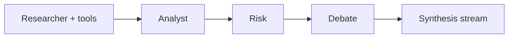

# Financial Agent

Event-driven stock research dashboard: **React** charts and news on the front end, **FastAPI** market data and a **multi-stage Groq agent** on the back end. Pick a ticker, explore OHLCV with sentiment-tagged news, then ask questions—the pipeline runs researcher → analyst → risk → debate → synthesis with tool calls (price ranges, similar periods, macro, options, SEC filings).

> **Outputs are analytical drafts, not investment advice.**

## Highlights

- **Interactive charts** — OHLCV via yfinance, news markers, draggable date ranges, “Analyze with AI” context injection
- **News + sentiment** — Multi-source news (Finnhub / Alpha Vantage / NewsAPI / DuckDuckGo fallbacks) scored with local **FinBERT**
- **Multi-agent chat** — Server-Sent Events stream with stage progress bar and token-by-token synthesis
- **Sessions & portfolio** — Persisted chat per session; watchlist API
- **Historical patterns** — SQLite + Chroma semantic search for “similar periods”

## Stack

| Layer | Technologies |
|-------|----------------|
| **Frontend** | React 19, Vite 8, TypeScript, Tailwind v4, Zustand, TanStack Query, lightweight-charts |
| **Backend** | FastAPI, sse-starlette, SQLite, ChromaDB |
| **LLM** | Groq — default model `meta-llama/llama-4-scout-17b-16e-instruct` (`GROQ_MODEL`) |
| **ML (local)** | ProsusAI/finbert (sentiment), all-MiniLM-L6-v2 (embeddings) |

Full architecture, API list, and maintainer notes: **[docs/HANDOFF.md](docs/HANDOFF.md)**

## Repository layout

| Path | Role |
|------|------|
| `backend/` | FastAPI app (`main.py`), REST + SSE chat, agents, market tools, DB |
| `frontend/` | Vite + React UI; dev proxy `/api` → `http://localhost:8000` |
| `docs/HANDOFF.md` | Engineering handoff (features, models, architecture, file map) |
| `requirements.txt` | Same as `backend/requirements.txt` — install from repo root for tests |
| `pytest.ini` | Runs `backend/tests` with `pythonpath=backend` |

## Prerequisites

- **Python 3.11+**
- **Node 20+**
- **`GROQ_API_KEY`** (required)

Optional (improve news/macro coverage): `FRED_API_KEY`, `FINNHUB_API_KEY`, `NEWSAPI_API_KEY`, `ALPHAVANTAGE_API_KEY`

Copy `backend/.env.example` → **`backend/.env`** and set at least `GROQ_API_KEY`. Settings also read a repo-root `.env` if present (overrides duplicates).

## Quick start

### Backend

```bash
python -m venv venv
venv\Scripts\activate
pip install -r backend/requirements.txt
copy backend\.env.example backend\.env
# Edit backend\.env — set GROQ_API_KEY
cd backend
uvicorn main:app --reload --host 0.0.0.0 --port 8000
```

First startup may download **FinBERT** (~440MB) in the background.

### Frontend

```bash
cd frontend
npm ci
npm run dev
```

Open the URL Vite prints (usually `http://localhost:5173`). API calls use `/api/v1/*` and are proxied to port `8000`.

### Verify

```bash
curl http://localhost:8000/health
```

```json
{"status":"ok","version":"2.0.0","model":"meta-llama/llama-4-scout-17b-16e-instruct"}
```

In the UI: select a ticker → chart loads → send a chat message and watch stages complete.

## Tests

From repository root:

```bash
pip install -r requirements.txt
python -m pytest -q
```

## Configuration

| Variable | Required | Used for |
|----------|----------|----------|
| `GROQ_API_KEY` | Yes | LLM (all agent stages) |
| `GROQ_MODEL` | No | Override default Groq model |
| `FRED_API_KEY` | No | Macro indicators tool |
| `FINNHUB_API_KEY` | No | Company news (preferred source) |
| `ALPHAVANTAGE_API_KEY` | No | News fallback |
| `NEWSAPI_API_KEY` | No | News fallback |
| `DATABASE_URL` | No | SQLite path (default under `backend/data/`) |
| `CHROMA_PATH` | No | Vector store directory |
| `CORS_ORIGINS` | No | Allowed frontend origins (JSON array) |

## Agent pipeline (overview)



**Tools:** price-range analysis, trend forecast, similar periods, news-by-category, macro (FRED), options flow, SEC filings. See [docs/HANDOFF.md](docs/HANDOFF.md) for SSE events and API routes.

## Docker

`backend/Dockerfile` and `frontend/Dockerfile` exist for container builds. Wire them in compose for API + static frontend if you deploy as a pair.

## Related: Claude for Financial Services

Institutional-style skills and slash commands (DCF, comps, etc.) live in [anthropics/claude-for-financial-services](https://github.com/anthropics/claude-for-financial-services). This app does not bundle them; use that repo in Claude Code alongside this dashboard when you need those workflows.

## License & disclaimer

Use at your own risk. Not financial advice. See [docs/HANDOFF.md](docs/HANDOFF.md) for operational limits (no auth, single-user SQLite, 180s chat timeout).
