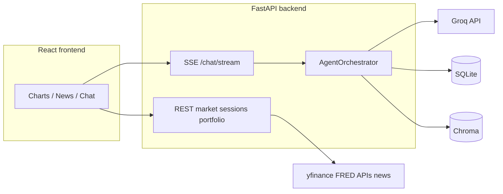

# Financial Agent — engineering handoff (v2)

This document is for the **next maintainer** or a **Claude (or other) assistant** taking over the repo. The codebase was consolidated around **FastAPI + React**; the legacy **Streamlit + `src/core/`** tree was removed to avoid duplicated agent logic and confusing layout.

---

## How Claude should work with this project (mandatory discipline)

**Rule:** Do not proceed with implementation until the human has confirmed the **plan** for that step. After each batch of edits, pause and ask the human to run the listed **Verification** commands (or to reply **approve** to delegate running them).

Ask the human to reply **approve** before you:

1. Change **Python or Node major versions**, or materially edit `backend/requirements.txt` / `frontend/package.json`.
2. Change **SQLite schema**, Chroma collection names, or migration strategy under `backend/data/`.
3. Edit **`TOOLS` definitions**, `execute_tool` routing, or **system prompts** in `backend/agents/orchestrator.py` (behavior, cost, and safety profile change).
4. Remove **news/API fallbacks** or require keys that were previously optional (availability risk).
5. Add **authentication**, **multi-tenancy**, or **PII-heavy logging** (compliance and scope change).

After edits, verify in this order unless the human specifies otherwise:

1. From repo root: `python -m pytest -q` (uses `pytest.ini` → `backend/tests`, `pythonpath=backend`).
2. Backend smoke: `cd backend` then `uvicorn main:app --reload --port 8000` → `GET http://localhost:8000/health` returns JSON `status: ok`.
3. Frontend smoke: `cd frontend && npm run dev` → pick a ticker → chart loads → chat sends a message and SSE stream completes.
4. If news/macro regressions are suspected: confirm optional keys in `backend/.env` match `backend/.env.example`.

---

## What this product is

A **single-user research dashboard** (not a bank-grade multi-tenant platform):

- **Frontend (`frontend/`)**: React 19 + Vite + Tailwind v4 plugin; TanStack Query; Zustand store (`useAppStore`). Dev server proxies `/api` → `http://localhost:8000` (`vite.config.ts`).
- **Backend (`backend/`)**: FastAPI, SSE chat (`sse-starlette`), SQLite + Chroma for sessions, chat history, watchlist, and semantic “similar period” search.
- **AI**: `AgentOrchestrator` in `agents/orchestrator.py` mirrors the old four-stage pipeline (researcher with tools → analyst → risk debate → synthesis tokens), using **async Groq** and emitting structured SSE events for the UI stage bar.

**Not in scope today:** OAuth, billing, rate-limit UX, institutional data vendors, formal compliance sign-off.

---

## Repository layout (streamlined)

```
financial_agent/
  README.md
  requirements.txt          # mirrors backend stack; pip from repo root
  pytest.ini                # testpaths=backend/tests, pythonpath=backend
  .gitignore
  docs/
    HANDOFF.md              # this file
  backend/
    main.py                 # FastAPI app + lifespan (DB init, FinBERT warm task)
    core/config.py          # pydantic-settings; loads backend/.env when cwd is backend/
    api/v1/                 # market, chat (SSE), analysis, sessions, portfolio
    api/v1/ws.py            # websocket routes (if used by UI — confirm in client)
    agents/orchestrator.py  # TOOLS[], execute_tool, AgentOrchestrator
    tools/market_data.py    # yfinance, news, FinBERT, FRED, SEC helpers
    db/db.py                # SQLite + Chroma
    data/                   # local DB + chroma (gitignored)
    tests/
    Dockerfile
    .env.example
  frontend/
    src/
      api/client.ts         # axios base /api/v1
      store/useAppStore.ts
      components/           # layout, dashboard, chart, news, chat, ui, search
    vite.config.ts
    Dockerfile
```

**Removed (intentionally):** `app.py`, `src/core/`, root `tests/`, `frontend/dist/`, unused Vite boilerplate (`main.ts`, `counter.ts`, `style.css`), and the orphaned `frontend/src/components/panels/` copy of components that nothing imported.

---

## Configuration

| Variable | Required | Used for |
|----------|----------|----------|
| `GROQ_API_KEY` | Yes | All LLM calls |
| `FRED_API_KEY` | No | Macro tool |
| `FINNHUB_API_KEY` | No | Primary company news |
| `ALPHAVANTAGE_API_KEY` | No | News |
| `NEWSAPI_API_KEY` | No | Broad news |
| `DATABASE_URL` | No | Defaults to sqlite under `backend/data/` |
| `CHROMA_PATH` | No | Vector store directory |
| `CORS_ORIGINS` | No | JSON list in `.env.example` |

`get_settings()` in `backend/core/config.py` loads **`backend/.env`** by absolute path and **ignores unknown keys**, so extra variables (e.g. from a root `.env` or shell) do not crash startup. SQLite/Chroma relative paths in settings still assume the server process **cwd** is `backend/` (as in the README `uvicorn` example).

---

## Architecture (runtime)



**Chat SSE event types** (see `backend/api/v1/chat.py`): `stage_start`, `stage_complete`, `debate_turn`, `synthesis_token`, `done`, `error`.

---

## Claude for Financial Services (external skills)

This repo **does not vendor** [Claude for Financial Services](https://github.com/anthropics/claude-for-financial-services). Use that project inside **Claude Code / Cowork** when you need slash workflows (`/dcf`, `/comps`, etc.) or IB-style skills.

**Patterns worth mirroring here (conceptual):**

- Prefer **authenticated or MCP-backed** figures for valuation and comps over ad-hoc web scraping when you harden the product.
- Treat all model output as **draft research**, not advice — align disclaimers with upstream guidance.
- **Human-in-the-loop:** any automation (scheduled reports, alerts) should surface uncertainty and data vintage.

---

## Frontend — quality notes and improvement backlog

| Area | Observation |
|------|----------------|
| **Duplication risk** | Large surface under `components/layout/` vs `components/dashboard/`; when adding features, pick one home per screen to avoid twin components. |
| **Dead code hygiene** | After refactors, grep for unused exports; the repo previously accumulated unreferenced `panels/` copies. |
| **Loading / errors** | Ensure every async view has skeleton/error states; FinBERT first load can be slow (backend warms in background, but first request may still stall). |
| **SSE UX** | Long-running chat: expose timeout messaging (backend uses 180s wait) and a cancel story if product needs it. |
| **Accessibility** | Charts and tickers: verify keyboard focus order, live regions for streaming text, color contrast for sentiment reds/greens. |
| **API base URL** | Dev uses Vite proxy; production build needs nginx (see `frontend/nginx.conf`) or env-based API origin — confirm deployment plan before changing `client.ts`. |

---

## Backend / data — defects and risks

| Topic | Detail |
|-------|--------|
| **Dual maintenance** | `agents/orchestrator.py` was copied from the legacy monolith with a comment “do not modify” — in practice, **any** tool change must stay consistent with `execute_tool` and frontend expectations. Consider extracting shared tool schemas once. |
| **Secrets in logs** | Startup prints and broad exception handlers can leak context; trim before any shared deployment. |
| **SQLite concurrency** | Single-file SQLite is fine for one user; concurrent writers will bottleneck — document before scaling. |
| **Torch / CPU** | `torch` + `transformers` are heavy; CI should cache wheels or use CPU index mirrors. |
| **WebSocket vs SSE** | `ws.py` is mounted separately; confirm whether the React client uses WebSockets or only SSE (`useSSEChat.ts`) to avoid half-maintained paths. |

---

## Automation and “better connection” ideas

- **CI:** GitHub Action running `python -m pytest -q` on push; optional `npm run build` for the frontend.
- **Compose:** Single `docker-compose.yml` wiring `frontend` (nginx static) + `backend` + optional env file — not yet first-class in repo.
- **MCP:** For institutional workflows, expose read-only MCP tools that wrap the same `tools/market_data` functions instead of duplicating fetch logic in another agent runtime.

---

## Quick commands (cheat sheet)

```bash
# Python
python -m venv venv
venv\Scripts\activate
pip install -r backend/requirements.txt
cd backend
uvicorn main:app --reload --port 8000

# Frontend
cd frontend
npm ci
npm run dev

# Tests (from repo root)
python -m pytest -q
```

---

## File map (where to change what)

| Concern | Location |
|---------|----------|
| LLM stages, tools, streaming | `backend/agents/orchestrator.py` |
| Market data, sentiment, news | `backend/tools/market_data.py` |
| Persistence | `backend/db/db.py` |
| HTTP routes | `backend/api/v1/*.py` |
| App settings | `backend/core/config.py` |
| Global UI state | `frontend/src/store/useAppStore.ts` |
| HTTP client | `frontend/src/api/client.ts` |

---

## Handoff to “Claude chat bot” prompt (paste as system or first message)

You are maintaining the **Financial Agent** repo. Stack: **FastAPI backend** in `backend/`, **React + Vite frontend** in `frontend/`. Legacy Streamlit was removed.

**Operating rules:**

1. Before dependency, schema, prompt, or tool-schema changes, ask the human for explicit **approve**.
2. After each change set, ask the human to run **`python -m pytest -q`** from repo root and a **manual UI smoke** (ticker → chart → chat).
3. Read **`docs/HANDOFF.md`** fully before large edits; prefer small diffs that match existing style.
4. For institutional finance workflows, defer to external **Claude for Financial Services** patterns; do not invent regulated advice copy.

End of handoff.
