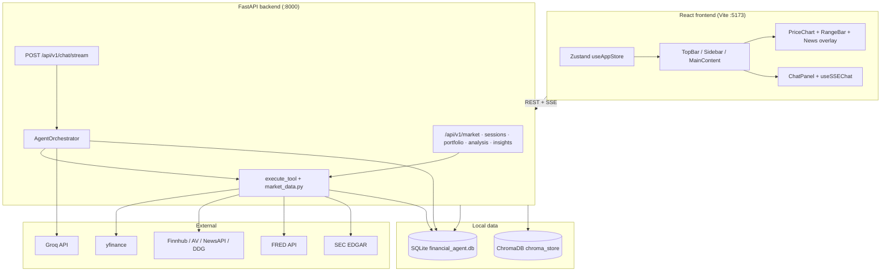
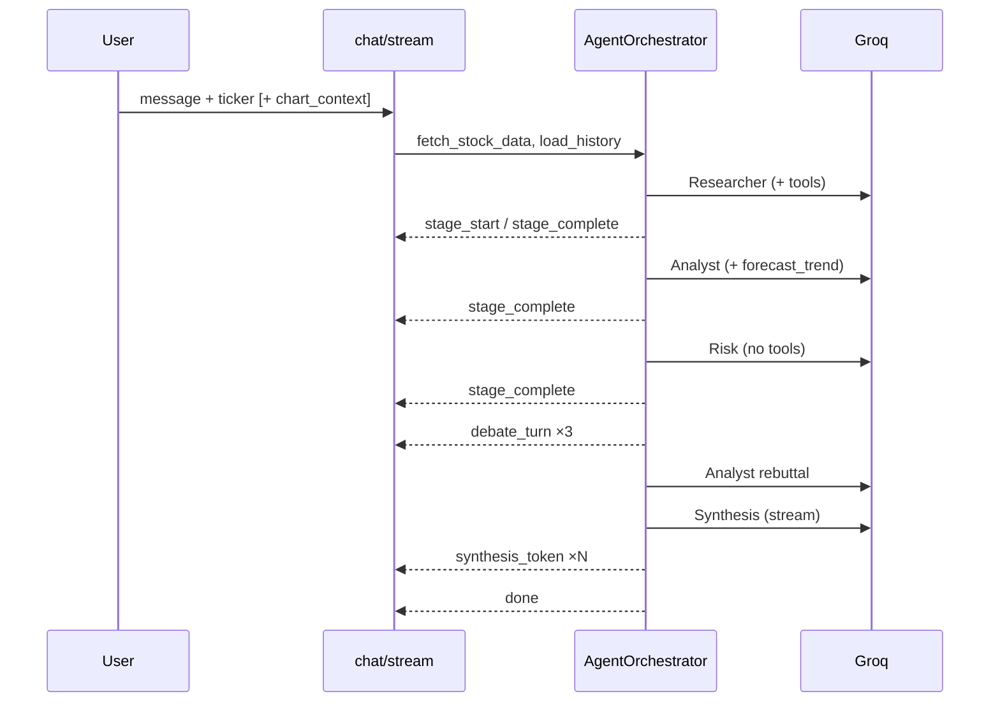

# Financial Agent — Engineering Handoff

**Audience:** Next maintainer, onboarding engineer, or AI assistant taking over the repo.  
**Last updated:** May 2026 · **Stack version:** API `2.0.0` (FastAPI + React)

---

## Executive summary

**Financial Agent** is a single-user stock research dashboard. Users pick a ticker, view OHLCV charts with news and sentiment overlays, and run a **multi-stage Groq LLM pipeline** (researcher → analyst → risk → debate → synthesis) that calls market-data tools (price ranges, macro, options, SEC filings, similar historical periods).

The codebase is **FastAPI (backend) + React/Vite (frontend)**. Legacy Streamlit and a duplicate `src/core/` tree were removed; all agent logic lives in `backend/agents/orchestrator.py`.

**This is not:** a multi-tenant brokerage, compliance-certified research product, or production trading system. Outputs are analytical drafts, not investment advice.

---

## Features (product surface)

| Area | What it does |
|------|----------------|
| **Ticker dashboard** | OHLCV from yfinance; period selector (5d–2y); sector filters; live price badge. |
| **Chart + news overlay** | `lightweight-charts` price chart; news markers; draggable range bar; range → “Analyze with AI” injects `chart_context` into chat. |
| **News feed** | Headlines from Finnhub → Alpha Vantage → NewsAPI → DuckDuckGo fallback chain; per-article **FinBERT** sentiment; category tags (earnings, product, etc.). |
| **AI chat (SSE)** | Four visible stages + analyst↔risk debate + streamed synthesis; `AgentStageBar` in UI; 180s server timeout. |
| **Sessions** | Per-ticker chat sessions; history persisted in SQLite; auto-created when user selects a ticker. |
| **Portfolio / watchlist** | Add/remove tickers with optional notes (session-scoped API). |
| **Range analysis API** | `POST /api/v1/analysis/range` — price stats + news for a date window (used by chart UI). |
| **Insights** | `POST /api/v1/insights/news-price-blurb` — short news/price correlation text. |
| **Similar periods** | Agent tool searches Chroma (semantic) then SQLite `historical_patterns` (sentiment similarity). |

### Agent tools (7)

Defined in `backend/agents/orchestrator.py` → executed by `execute_tool()`:

1. `analyze_price_range` — OHLCV stats + news in a date window  
2. `forecast_trend` — bullish/bearish probability from sentiment + momentum  
3. `find_similar_periods` — Chroma + SQL historical pattern match  
4. `summarize_news_category` — aggregate news by category  
5. `get_macro_context` — FRED indicators (needs `FRED_API_KEY`)  
6. `get_options_flow` — put/call ratio, IV via yfinance options chain  
7. `get_sec_filings` — recent EDGAR filings  

**Tool assignment by stage:**

| Stage | Tools |
|-------|--------|
| Researcher | All except `forecast_trend` |
| Analyst | `forecast_trend` only |
| Risk | None (text critique) |
| Synthesis | No tools; streams final report |

---

## Frameworks & dependencies

### Backend (`backend/`)

| Layer | Technology |
|-------|------------|
| API | **FastAPI** 0.115+, **uvicorn**, **pydantic-settings** |
| Streaming | **sse-starlette** (`POST /api/v1/chat/stream`) |
| LLM | **groq** async client (`AsyncGroq`) |
| Market data | **yfinance**, **pandas**, **requests** |
| Sentiment (local) | **transformers** + **torch** — `ProsusAI/finbert` |
| Embeddings (local) | **sentence-transformers** — `all-MiniLM-L6-v2` |
| Macro | **fredapi** (optional `FRED_API_KEY`) |
| Persistence | **SQLite** (sessions, chat, news cache, patterns) |
| Vector search | **ChromaDB** (file-based under `data/chroma_store`) |
| Tests | **pytest**, **pytest-asyncio** |

### Frontend (`frontend/`)

| Layer | Technology |
|-------|------------|
| UI | **React 19**, **TypeScript** |
| Build | **Vite 8**, `@vitejs/plugin-react` |
| Styling | **Tailwind CSS v4** (`@tailwindcss/vite`) |
| State | **Zustand** (`useAppStore`) |
| Server state | **TanStack React Query** (`useMarketData`) |
| HTTP | **axios** → `/api/v1` (dev proxy to `:8000`) |
| Charts | **lightweight-charts** v5 |
| Markdown (chat) | **react-markdown** |
| Icons | **lucide-react** |

### Models in use

| Role | Model / service | Config |
|------|-----------------|--------|
| **All LLM stages** | `meta-llama/llama-4-scout-17b-16e-instruct` | `GROQ_MODEL` in `.env` (default in `core/config.py`) |
| **News sentiment** | `ProsusAI/finbert` (local, ~440MB first download) | Warmed on API startup in background |
| **Pattern embeddings** | `all-MiniLM-L6-v2` | Chroma collection `historical_patterns` |

Provider: **[Groq](https://groq.com)** — requires `GROQ_API_KEY`.

---

## Architecture

### System diagram



### Multi-agent pipeline (chat)



**SSE event types** (`backend/api/v1/chat.py`):

| Event | Payload highlights |
|-------|-------------------|
| `stage_start` | `stage`: `researcher` \| `analyst` \| `risk` \| `synthesis` |
| `stage_complete` | `stage`, `summary` (truncated) |
| `debate_turn` | `speaker`, `content`, `turn` |
| `synthesis_token` | `token` |
| `done` | `session_id` |
| `error` | `message` |

**Note:** `backend/api/v1/ws.py` is a placeholder; chat uses **SSE only** (`frontend/src/hooks/useSSEChat.ts`).

### Repository layout

```
financial_agent/
├── README.md
├── requirements.txt          # mirrors backend; pytest from repo root
├── pytest.ini
├── docs/
│   └── HANDOFF.md            # this file
├── backend/
│   ├── main.py               # FastAPI app, lifespan (DB init, FinBERT warm)
│   ├── core/config.py        # pydantic-settings, .env loading
│   ├── api/v1/               # market, chat, analysis, sessions, portfolio, insights
│   ├── agents/orchestrator.py
│   ├── tools/market_data.py
│   ├── db/db.py
│   ├── data/                 # sqlite + chroma (gitignored; may exist locally)
│   ├── tests/
│   ├── .env.example
│   └── requirements.txt
└── frontend/
    ├── src/
    │   ├── api/client.ts
    │   ├── store/useAppStore.ts
    │   ├── hooks/            # useSSEChat, useMarketData
    │   └── components/       # layout, chart, news, chat, shared, ui
    ├── vite.config.ts        # proxies /api → localhost:8000
    └── package.json
```

---

## API reference (quick)

Base path: `/api/v1`

| Method | Path | Purpose |
|--------|------|---------|
| `GET` | `/health` | Health check (on app root, not under v1) |
| `GET` | `/market/{ticker}` | OHLCV + news + sentiment (`period`, `include_news`) |
| `GET` | `/market/{ticker}/sentiment` | Aggregate sentiment |
| `POST` | `/chat/stream` | SSE multi-agent chat |
| `POST` | `/analysis/range` | Range stats for chart |
| `POST` | `/insights/news-price-blurb` | Short insight text |
| `GET/POST/DELETE` | `/sessions`, `/sessions/{id}` | Session CRUD |
| `GET/POST/DELETE` | `/portfolio`, `/portfolio/{ticker}` | Watchlist |

---

## Configuration

Copy `backend/.env.example` → `backend/.env` (and optionally repo-root `.env` for overrides).

| Variable | Required | Purpose |
|----------|----------|---------|
| `GROQ_API_KEY` | **Yes** | All LLM calls |
| `GROQ_MODEL` | No | Default: `meta-llama/llama-4-scout-17b-16e-instruct` |
| `FRED_API_KEY` | No | Macro tool |
| `FINNHUB_API_KEY` | No | Primary company news |
| `ALPHAVANTAGE_API_KEY` | No | News fallback |
| `NEWSAPI_API_KEY` | No | News fallback |
| `DATABASE_URL` | No | Default `sqlite:///./data/financial_agent.db` |
| `CHROMA_PATH` | No | Default `./data/chroma_store` |
| `CORS_ORIGINS` | No | JSON list for frontend origins |

`get_settings()` loads `backend/.env` first, then repo-root `.env` (later wins). Unknown keys are ignored.

**Working directory:** Run uvicorn from `backend/` so relative SQLite/Chroma paths resolve correctly.

---

## Local development

```bash
# Backend
python -m venv venv
venv\Scripts\activate          # Windows
pip install -r backend/requirements.txt
copy backend\.env.example backend\.env   # set GROQ_API_KEY
cd backend
uvicorn main:app --reload --host 0.0.0.0 --port 8000

# Frontend (separate terminal)
cd frontend
npm ci
npm run dev
```

**Tests** (repo root):

```bash
python -m pytest -q
```

**Smoke checklist**

1. `GET http://localhost:8000/health` → `status: ok`, `model` set  
2. Open Vite URL → pick ticker → chart loads  
3. Send chat message → stage bar advances → synthesis completes  
4. Optional: confirm news with/without Finnhub key  

---

## File map (where to change what)

| Concern | Location |
|---------|----------|
| LLM stages, tools, prompts, streaming | `backend/agents/orchestrator.py` |
| Prices, news, FinBERT, FRED, SEC, options | `backend/tools/market_data.py` |
| SQLite schema, Chroma, sessions | `backend/db/db.py` |
| HTTP routes | `backend/api/v1/*.py` |
| Settings | `backend/core/config.py` |
| Global UI state, tabs, chart range | `frontend/src/store/useAppStore.ts` |
| API client types | `frontend/src/api/client.ts` |
| SSE chat UX | `frontend/src/hooks/useSSEChat.ts` |
| Chart | `frontend/src/components/chart/` |

---

## Known limitations & risks

| Topic | Detail |
|-------|--------|
| **Single-user SQLite** | Fine for local dev; concurrent writes will bottleneck. |
| **Heavy deps** | `torch` + FinBERT slow first request; CI should cache Hugging Face models. |
| **Tool/schema drift** | `TOOLS` in orchestrator must stay in sync with `execute_tool` and UI expectations. |
| **180s chat timeout** | Long analyses may hit `asyncio.wait_for` in `chat.py`. |
| **WebSocket stub** | Do not wire chat to `ws.py` without implementing routes. |
| **Production API URL** | Dev uses Vite proxy; production needs reverse proxy or env-based `baseURL` in `client.ts`. |
| **No auth** | Do not expose publicly without adding auth and rate limits. |

---

## Maintainer discipline (for humans + AI assistants)

Before changing **dependencies, DB schema, tool definitions, or system prompts**, get explicit human approval.

After edits, run:

1. `python -m pytest -q` (repo root)  
2. Backend + frontend smoke (ticker → chart → chat)  

For institutional workflows (DCF, comps, etc.), use external **[Claude for Financial Services](https://github.com/anthropics/claude-for-financial-services)** — not bundled here.

---

## Handoff prompt (paste for a new AI session)

You are maintaining **Financial Agent**: FastAPI in `backend/`, React+Vite in `frontend/`. Read `docs/HANDOFF.md` before large changes. LLM is **Groq** (`meta-llama/llama-4-scout-17b-16e-instruct` by default). Chat is **SSE**, not WebSocket. Do not treat model output as investment advice. Ask for human **approve** before dependency, schema, or prompt/tool changes; then run `python -m pytest -q` and UI smoke.

---

## Disclaimer

All outputs are analytical drafts for research and education, **not** investment advice.
